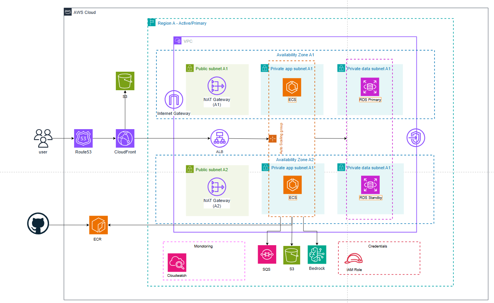

# 🤖AI Content Web Service

An backend service designed to automate content research, trend analysis, and content generation for business owners and content creators.


## 🛠 Technical Stack

| Component | Technology | Description |
| :--- | :--- | :--- |
| **Language** | Java 17+ | Modern Java Records & Features |
| **Framework** | Spring Boot `3.2.0` | Core Application Framework |
| **Security** | Spring Security & JJWT `0.11.5` | Stateless JWT Authentication & RBAC |
| **Persistence** | Spring Data JPA / Hibernate | ORM & Data Access |
| **Database** | PostgreSQL / H2 (In-memory) | Production / Test Datasources |
| **Migration** | Flyway | Database version control & schema migration |
| **Build Tool** | Gradle | Multi-module build management |

## 📦 Package
This project adopts a **Modular Monolith** architecture based on **Clean Architecture** principles.

```text
📦 content_web (Root)
├── 🎯 core-domain/                     # Domain & Business Layer (Core Logic)
│   ├── common/                          # Cross-domain error handling & common models
│   │   └── error/                       # CustomException, ErrorCode definitions
│   └── user/                            # User Bounded Context
│       ├── domain/                      # Pure Domain Models (Java Records: User, UserRole, UserStatus)
│       └── service/                     # Application Services & Port Interfaces
│           ├── UserService.java         # Domain logic & orchestration
│           └── UserRepository.java      # Output Port (Repository Interface)
│
├── 💾 db-core/                          # Persistence & Storage Layer (Adapters)
│   ├── BaseEntity.java                  # MappedSuperclass with auditing timestamps
│   └── user/                            # User Persistence Implementation
│       ├── UserEntity.java              # JPA Entity & Domain mapper (toDomain)
│       ├── UserJpaRepository.java       # Spring Data JPA Repository
│       └── UserCoreRepository.java      # Adapter implementing UserRepository (Port)
│
└── 🌐 core-api/                         # Presentation Layer (HTTP & Infrastructure)
    ├── AIContentApplication.java        # Spring Boot main entrypoint
    ├── config/                          # Infrastructure & Framework Configurations
    │   ├── jwt/                         # JWT token provider, properties & payload
    │   ├── security/                    # Spring Security & JwtAuthenticationFilter
    │   └── web/                         # WebMvcConfigurer & CurrentUserArgumentResolver
    └── controller/                      # REST API Endpoints
        ├── HealthController.java        # Health check endpoint
        ├── user/                        # User REST Controllers
        └── advice/                      # Global exception handling & standard API responses
```
## 🌐Architecture System


##  🧱 ERD

