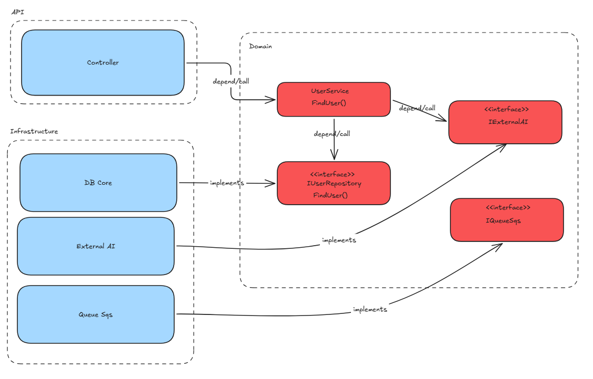
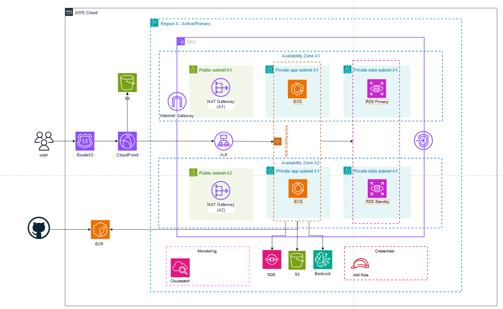

# 🤖AI Content Web Service

An backend service designed to automate content research, trend analysis, and content generation for business owners and content creators.


## 🛠 Technical Stack

| Component | Technology | Description |
| :--- | :--- | :--- |
| **Language** | Java 17+ | Modern Java Records & Features |
| **Framework** | Spring Boot `3.2.0` | Core Application Framework |
| **Security** | Spring Security & JJWT `0.11.5` | Stateless JWT Authentication & RBAC |
| **Persistence** | Spring Data JPA / Hibernate | ORM & Data Access |
| **Database** | PostgreSQL / H2 (In-memory) | Production / Test Datasources |
| **Migration** | Flyway | Database version control & schema migration |
| **Build Tool** | Gradle | Multi-module build management |

## 📦 Package
This project adopts a **Modular Monolith** architecture based on **Clean Architecture** principles.



```text
📦 Content AI Backend
├── 🎯 core-domain/                         # Domain & Application Layer
│   ├── common/
│   │   └── error/
│   │       ├── CustomException.java
│   │       └── ErrorCode.java
│   │
│   └── feature/
│       ├── domain/                         # Pure Domain Models
│       │   ├── Feature.java
│       │   └── ...
│       │
│       └── service/                        # Application Services & Ports
│           ├── FeatureService.java         # Business logic & orchestration
│           ├── FeatureRepository.java     # Output Port
│           └── AiGenerator.java            # Output Port
│
├── 💾 db-core/                              # Database Adapter
│   └── feature/
│       ├── FeatureEntity.java
│       ├── FeatureJpaRepository.java
│       └── FeatureCoreRepository.java      # Adapter
│
│
├── 📨 queue-sqs/                            # AWS SQS Adapter
│   └── producer/
│       └── SqsJobProducer.java
│
├── ⏰ schedule/                             # Scheduled Jobs
│   ├── config/
│   └── job/
│       ├── RetryJob.java
│       └── CleanupJob.java
│
│
├── 🤖 ai-worker/                            # AI Worker Application
│   ├── AiWorkerApplication.java                         
│
└── 🌐 core-api/                             # REST API / Composition Root
    ├── AIContentApplication.java
    │
    ├── config/
    │   ├── SecurityConfig.java
    │   ├── JacksonConfig.java
    │   └── ...
    │
    └── controller/
        ├── content/
        ├── idea/
        ├── brandprofile/
        └── ...
```
## 🌐Architecture System


##  🧱 ERD

